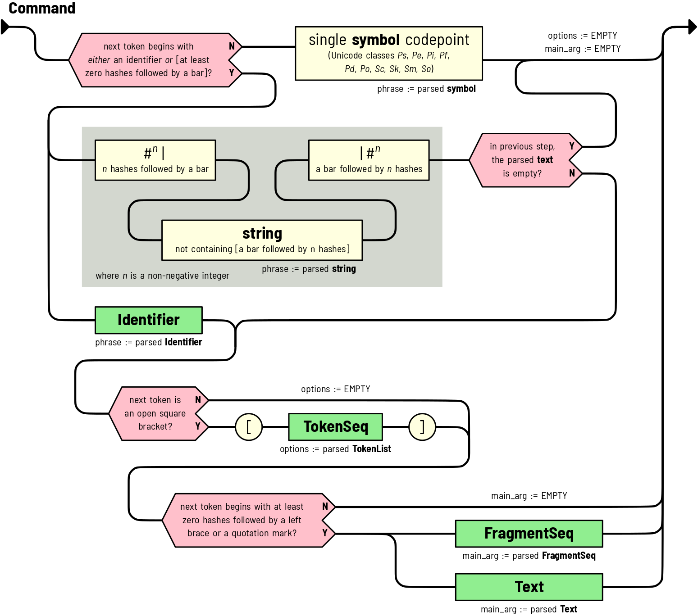
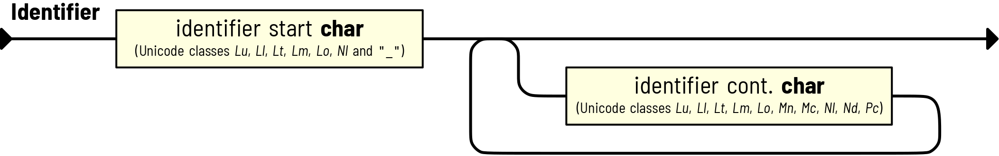

# Syntax Reference

Below are syntax descriptions of Paxter language.

(document-rule)=
## Document Rule

The **starting rule** of Paxter language grammar
which is a special case of .
The result of parsing this rule is always
a {class}`FragmentSeq <paxter.parse.data.FragmentSeq>` node
whose children includes non-empty strings
(as {class}`Text <paxter.parse.data.Text>` nodes),
interleaving with the result produced by .

(command-rule)=
## Command Rule

Rule for parsing the textual content after
encountering the `@`-switch symbol character.

:::{admonition,caution} What are the red shapes?
Red shapes appeared in the above diagram indicates a branching path
of parsing depending on conditions specified with the shapes.
:::

There are a few possible scenarios.

1. The first token is an identifier.
   The parsed identifier becomes the phrase part of the
   {class}`Command <paxter.parse.Command>`.
   Then the parser would attempt to parse the options section
   and the main argument section if they exist.
2. The first token is {math}`n` hash characters followed by a bar character.
   Then the parser will attempt to parse for the phrase part non-greedily
   until a bar character followed by {math}`n` hash characters are found.
   If the parsing result of the phrase is not empty,
   then the parser would continue on trying to parse for the options section
   and the main argument section.

   However, if the phrase is empty, then the options section
   as well as the main argument section are assumed to be empty.

3. The first token is a single symbol character.
   This would result in such symbol becoming the sole content of the phrase section,
   while other sections (i.e. options and main argument) are empty.

(fragmentseq-rule)=
## FragmentSeq Rule

This rule always begins with {math}`n` hash characters followed by a left brace
and ends with a right brace followed by {math}`n` hash characters,
for some non-negative integer {math}`n`.
Between this pair of curly braces is an interleaving of strings
(as {class}`Text <paxter.parse.data.Text>`)
and {class}`Command <paxter.parse.data.Command>`,
all of which are children of {class}`FragmentSeq <paxter.parse.data.FragmentSeq>` instance.

One important point to note is that each string is parsed non-greedily;
each resulting string would never contain a right brace
followed by {math}`n` or more hash characters.

(text-rule)=
## Text Rule

This rule is similar to  except for two main reasons.
The first reason is that nested {class}`Command <paxter.parse.data.Command>`
will not be parsed (i.e. `"@"` is not a special character in this scope).
Another reason is that, instead of having a matching pair of curly braces
indicate the beginning and the ending of the rule,
quotation marks are used instead.

(tokenseq-rule)=
## TokenSeq Rule

Following this parsing rule results in a sequence of zero or more tokens,
possibly separated by whitespaces.
Each token may be a {class}`Command <paxter.parse.data.Command>`,
an {class}`Identifier <paxter.parse.data.Identifier>`,
an {class}`Operator <paxter.parse.data.Operator>`,
a {class}`Number <paxter.parse.data.Number>`,
a {class}`FragmentSeq <paxter.parse.data.FragmentSeq>`,
a {class}`Text <paxter.parse.data.Text>`,
or a nested {class}`TokenSeq <paxter.parse.data.TokenSeq>`.
This resulting sequence of tokens are children of
{class}`TokenSeq <paxter.parse.data.TokenSeq>` node type.

:::{note}
The option section (or the token list) is the only place where whitespaces
are ignored when they appear between tokens.
:::

(identifier-rule)=
## Identifier Rule

This rule generally follows python rules for greedily parsing
an identifier token (with some extreme exceptions).
The result is an {class}`Identifier <paxter.parse.data.Identifier>` node type.

(operator-rule)=
## Operator Rule

Greedily consumes as many operator characters as possible
(with two notable exceptions: a common and a semicolon,
each of which has to appear on its own).
Whitespace characters may be needed to separate two consecutive,
multi-character operator tokens.
The result is an {class}`Operator <paxter.parse.data.Operator>` node type.

